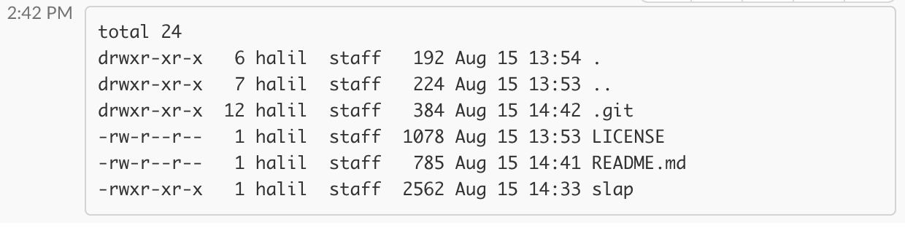

# Slap

Pipes command line output to Slack

## Usage

```bash
ls -la | slap #general
echo "message from cli" | slap @halil.ibrahim
```



## Install

You need a legacy token which can be issued [here](https://api.slack.com/custom-integrations/legacy-tokens).

Then, you need to set an environment variable using this token.

```bash
echo "export SLACK_LEGACY_TOKEN=your-token" >> ~/.bash_profile
source ~/.bash_profile
```

Finally, download the script into `/usr/local/bin` using following command.

```bash
wget https://raw.githubusercontent.com/hisener/slap/master/slap -P /usr/local/bin && chmod +x /usr/local/bin/slap
```

## Uninstall

Simply remove the script file and remove `export` statement from your `.bash_profile`.

## Licence

[MIT. Copyright (C)](LICENSE) [Halil İbrahim Şener](http://halilsener.com).
